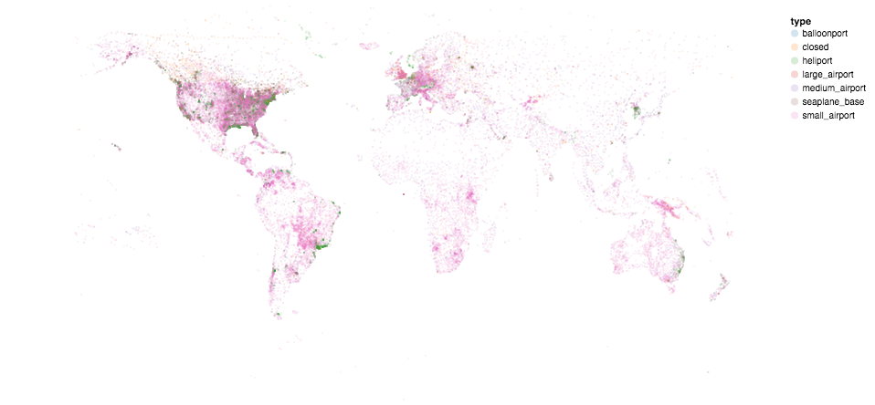
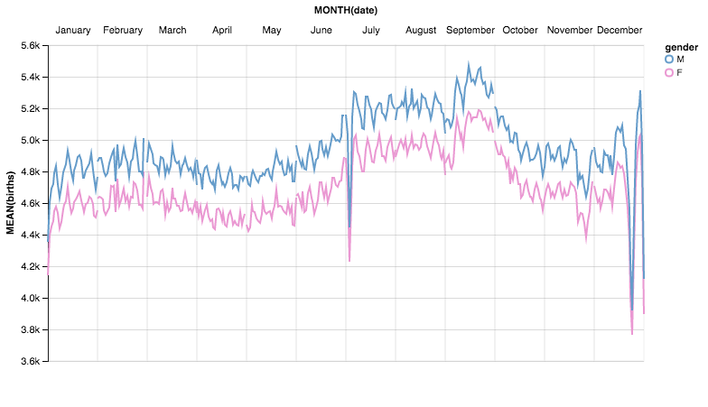
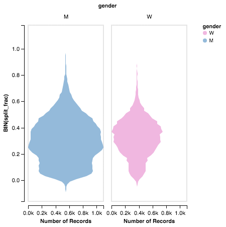
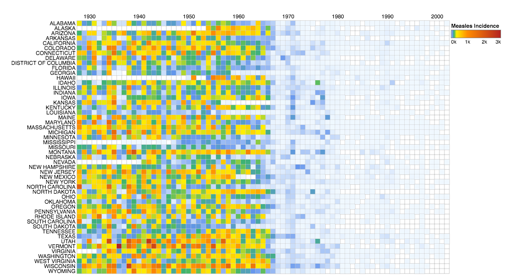
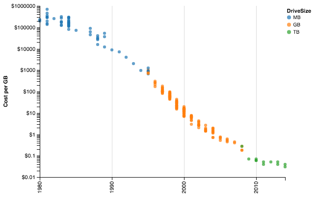
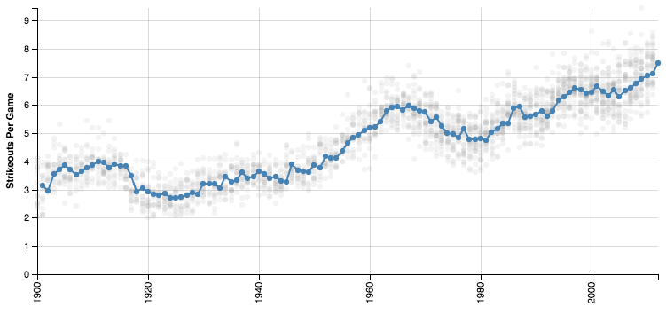

# Altair Examples

This repository contains some examples of visualizations using [Altair](http://altair-viz.github.io).
These examples use datasets gathered from around the web, which are stored in the [data](data/) directory.
All notebooks are in the [notebooks](notebooks/) directory; click on any image to see the associated notebook:

            
If you have any visualization you would like to contribute, please feel free to open a [Pull Request](https://github.com/jakevdp/altair-examples/pulls)!
